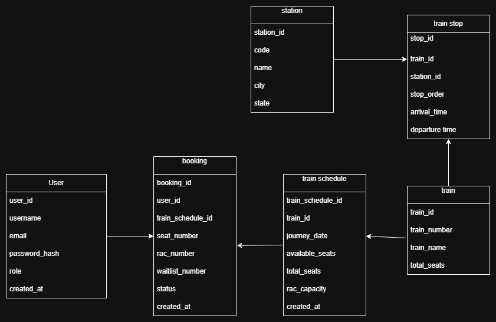

# IRCTC Backend System

A backend system that simulates railway ticket booking with real-world features like Confirmed tickets, RAC (Reservation Against Cancellation), and Waitlist handling.

---

## Features

* User Authentication (JWT-based login/signup)
* Train Search (source → destination → date)
* Ticket Booking System:

  *  Confirmed Tickets
  *  RAC (Reservation Against Cancellation)
  *  Waitlist
* Cancellation Handling (automatically promotes passengers from Waitlist → RAC → Confirmed).
* Concurrency-safe booking using database row locking

---

## Tech Stack

* **Framework:** Flask (Python)
* **Database:** PostgreSQL
* **ORM:** SQLAlchemy
* **Auth:** Flask-JWT-Extended
* **Validation:** Marshmallow

---

##  Database Design



---
## Booking Flow

1. User searches trains (source → destination → date)
2. System checks available seats in train schedule
3. Booking allocation:
   - If seats available → Confirmed
   - If full → RAC
   - If RAC full → Waitlist
4. On cancellation:
   - Waitlist → promoted to RAC
   - RAC → promoted to Confirmed
     
 ---
 ## API Endpoints

### Auth APIs
- POST /api/auth/register
- POST /api/auth/login
- GET /api/auth/me

### Admin APIs
- POST /api/stations
- POST /api/trains
- POST /api/train_schedules
- POST /api/train_stops
  
**Note:**  These require an admin JWT token.

### User APIs
- GET /api/stations
- GET /api/trains
- GET /api/search
- POST /api/bookings
- GET /api/bookings
- DELETE /api/bookings/<id>
   
**Note:** Some endpoints require JWT authentication.  
Login first and include the token in headers:

Authorization: Bearer <your_token>

  ---
##  API Testing

Postman collection available in `/postman` folder.
### Steps:
1. Open Postman
2. Click "Import"
3. Upload the JSON file
4. Run Login API
5. Copy JWT token
6. Add token in Authorization header
7. Test endpoints

---

### Example APIs Covered:
- User Registration & Login
- Train Search
- Ticket Booking (Confirmed / RAC / Waitlist)
- Cancel Booking
- Booking History

---

##  Run Locally

1. Clone the repo:

```bash
git clone https://github.com/Sohini-Ghosh2004/irctc-backend.git
cd irctc-backend
```

2. Install dependencies:

```bash
pip install -r requirements.txt
```

3. Setup environment variables (`.env`):

```env
DATABASE_URL=your_postgres_url
JWT_SECRET_KEY=your_secret_key
```
4. Database Seeding

Run scripts in order to populate stations, trains, schedules, and stops:

```bash
python scripts/import_stations.py
python scripts/generate_trains.py
python scripts/generate_schedules.py
python scripts/generate_train_stops.py
```
5. Run server:

```bash
python run.py
```

---

